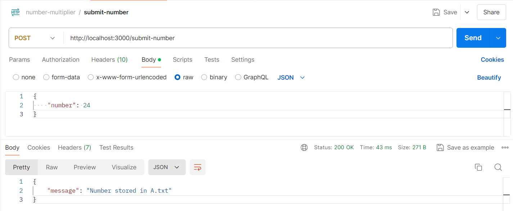
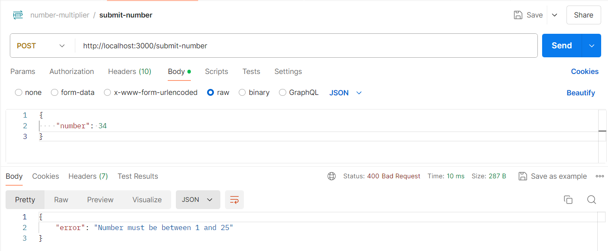
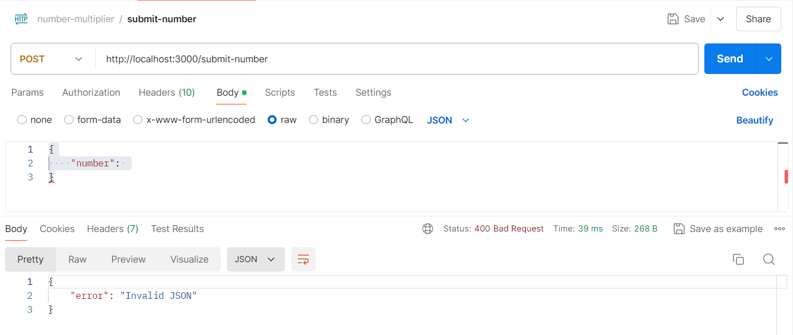
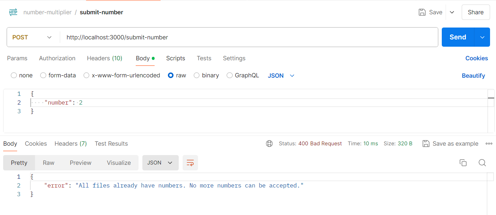
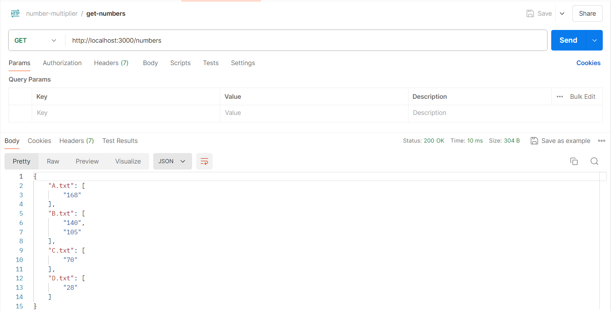

# Node.js Number Processing API

This Node.js application processes numbers entered by the user via a dashboard. The number is multiplied by 7, and based on the result, it is stored in one of four files (A.txt, B.txt, C.txt, D.txt). Once all files have at least one number, no more numbers can be accepted. The stored numbers can be retrieved via an API endpoint.

## Features

- Multiplies input numbers by 7 and stores the result in different files based on the value.
- Ensures no more numbers are accepted once all files have at least one number.
- Provides an endpoint to retrieve all stored numbers.

## Endpoints

### POST `/submit-number`

- **Description:** Submits a number to be processed and stored.
- **Request Body:**
  ```json
  {
    "number": 5
  }
  ```
- **Responses:**
  - **200 OK:**
    ```json
    {
      "message": "Number stored in A.txt"
    }
    ```
  - **400 Bad Request:**
    ```json
    {
      "error": "Number must be between 1 and 25"
    }
    ```
    ```json
    {
      "error": "Invalid JSON"
    }
    ```
    ```json
    {
      "error": "All files already have numbers. No more numbers can be accepted."
    }
    ```
  - **500 Internal Server Error:**
    ```json
    {
      "error": "Failed to write to file: error details"
    }
    ```

### GET `/numbers`

- **Description:** Retrieves all stored numbers from the files.
- **Responses:**
  - **200 OK:**
    ```json
    {
      "A.txt": ["35", "42"],
      "B.txt": ["105"],
      "C.txt": ["70"],
      "D.txt": ["21"]
    }
    ```
  - **500 Internal Server Error:**
    ```json
    {
      "error": "Failed to read files: error details"
    }
    ```

## Usage

1. **Clone the repository:**

   ```sh
   git clone https://github.com/your-username/your-repo-name.git
   cd your-repo-name
   ```

2. **Install dependencies:**

   ```sh
   npm install
   ```

3. **Start the server:**

   ```sh
   node index.js
   ```

4. **Test the endpoints using Postman:**

   - **POST `/submit-number`**

     
     _Positive Scenario: Successfully storing a number_

     
     _Negative Scenario: Invalid number input_

     
     _Negative Scenario: Invalid json input_

     
     _Negative Scenario: All files already have numbers_

   - **GET `/numbers`**

     
     _Positive Scenario: Retrieving all stored numbers_
